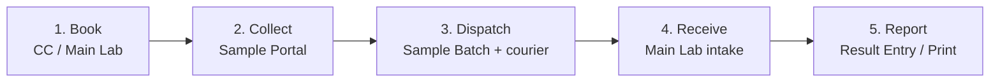

# LIMS complete flow — Hub & Spoke (as implemented)

**Product:** Madina Medical Complex HMS · Pathology / LIMS  
**Timezone:** `Asia/Karachi`  
**Audience:** QA, ops, developers  
**Truth source:** code + Blade routes **as of now** (not aspirational Phase 5)

Related docs: `lims-hub-spoke-architecture.md`, `lims-phase-0.md` … `lims-phase-4.md`, `lims-ui.md`

---

## 0. Big picture / Badi tasveer

One **Main Lab (Hub)** receives samples from many **Collection Centers (Spokes)**. Legacy pathology UI (`laboratory_patients`, Sample Portal, Result Entry) still runs; LIMS **dual-writes** normalized rows (`lims_*`) and adds **sample batches** + **commission / cash APIs**.



| Step | Who | Primary UI / API |
|------|-----|------------------|
| Book | CC or Main Lab | `GET/POST /pathology/bookings` |
| Collect | CC (or any Sample Collection user) | `/pathology/sample-portal` |
| Batch pack / dispatch | **CC** | `/pathology/sample-batches` |
| In transit | CC **or** Main Lab | same batch show page |
| Receive | **Main Lab only** | batch → Receive form |
| Results / print | Result Entry / Front Desk | legacy pathology paths |
| Doctor ledger / payout | Main Lab / Commission Admin | ledger **Blade** (read-only) + payout **API** |
| Cash close | CC open/submit · Main Lab approve | **API only** (no Blade) |

---

## 1. Setup — pehle yeh ready ho

### 1.1 Organization & sites

| What | How |
|------|-----|
| Org `MMC` | `php artisan db:seed --class=LimsOrganizationSeeder` |
| Sites | `MAIN` (kind `main_lab`) + spokes e.g. `CC1`, `CC2` |
| Sequences | MR (`mr_number_sequences`), lab numbers per CC/month, manifest per CC/day |

**UI:** `GET /pathology/collection-centers` — Main Lab scope **or** permission `Manage Collection Centers` **or** Super Admin.

### 1.2 Users / scopes

| `user_scope` | `collection_center_id` | Meaning |
|--------------|------------------------|---------|
| `main_lab` | **must be null** | Global hub ops |
| `collection_center` | **required** CC id | Locked to that spoke |

Assign lab permissions via User Manager (`admin.user_manager`) or seeder.  
`EnsureModuleAccess` + `LabPermissions`:

- **Main Lab scope implies** (without explicit grant): `Commission Admin`, `Doctor Payout`, `Manage Collection Centers`, `Cash Approve`.
- **Does not imply:** `Create Booking`, `Sample Collection`, `Result Entry`, `Cash Close`, etc. — grant those explicitly.
- **Sample batches:** special-cased — `LabPermissions::canAccessSampleTransit()` (CC scope, Main Lab scope, Sample Collection, Lab Attendant, or Super Admin).

Re-seed permission catalog after deploy:

```bash
php artisan db:seed --class=RolesAndPermissionsSeeder
```

### 1.3 Referring doctors & commission

| UI | URL |
|----|-----|
| Doctors | `/pathology/lims-doctors` |
| Ledger (read-only) | `/pathology/lims-doctors/{id}/ledger` |
| Rules | `/pathology/commission-rules` |
| Snapshots audit | `/pathology/commission-snapshots` |

Rules: `fixed` or `percent`; optional doctor / category / test / CC; `effective_from` / `effective_to`.  
**Categories:** `lims_test_categories` (Blade + seeder); link tests via `tests.test_category_id` when matching by category.

### 1.4 Test catalog (legacy)

Still managed under pathology: Manage Test / Test Heads / catalog sync. Booking picks tests into `laboratory_patients.selected_tests` JSON; LIMS dual-write copies lines into `lims_booking_items`.

---

## 2. Patient booking — book karna

**URL:** `GET /pathology/bookings/create` → `POST /pathology/bookings`  
**Permission:** `Create Booking`

| Actor | CC behaviour |
|-------|----------------|
| **CC user** | Center locked to `auth.collection_center_id` (hidden + read-only) |
| **Main Lab / global** | Required dropdown of **active** `collection_centers` |

### What happens on store (`BookingController`)

1. Creates legacy `laboratory_patients` (billing, tests JSON, daily `lab_registration_no`).
2. Calls `LimsBookingSync::syncQuietly($patient, $user, $collectionCenterId)`:
   - Upserts `lims_patients` (MR via `MrNumberAllocator` if blank)
   - Creates `lims_bookings` with CC-prefixed **lab number** (`LabNumberAllocator`, e.g. `CC1-202607-0001`)
   - Lines → `lims_booking_items`
   - `lims_invoices` + cash `lims_payments` when `paid_amount` > 0
   - Resolves/creates `lims_doctors` from referrer name (unless self-referred)
   - **`CommissionSnapshotService::snapshotBooking`** — immutable snapshots + ledger CREDIT (same TX)
   - Payment stamps `cash_closure_id` if an **open** cash drawer exists for that CC
3. Redirect → Sample Portal + flash: collect → Sample Batch → dispatch.

Sync failures are logged; **legacy booking is kept** (`syncQuietly`).

---

## 3. Sample collect — Sample Portal

**URL:** `/pathology/sample-portal`  
**Permission:** `Sample Collection`

Collect / print barcodes (HTML / ZPL / TSPL). On collect, `LimsSampleSync::syncFromVial`:

| Stamp | Fields |
|-------|--------|
| Collector | `lims_samples.collected_by`, `collected_by_name` (first collect only; refresh keeps stamp) |
| Status | mapped from legacy vial → usually `collected` |

Legacy Lab Attendant (`/pathology/lab_attendant`) still exists for single-vial scan; prefer **Sample Batches** for multi-CC custody.

---

## 4. Sample batches — transit / chain of custody

**URLs:** `/pathology/sample-batches` (+ create / show / dispatch / in-transit / receive)  
**API mirror:** `/api/v1/sample-batches*` (session cookie auth)

| Status | Who | Stamps / notes |
|--------|-----|----------------|
| **open** | **CC** create + add/remove collected samples | Manifest via `ManifestNumberAllocator` |
| **dispatched** | **CC** | **Required** `courier_name`; optional `courier_ref`; `dispatched_by` + `dispatched_by_name` (logged-in user) |
| **in_transit** | CC or Main Lab | Transit event `actor_user_id` + `actor_name` |
| **received** (batch) | **Main Lab only** | `received_by` + `received_by_name` |
| Item **received** / **missing** / **rejected** | Main Lab | `receive_marked_by` (+ name); reject note; receive pushes legacy vial → `in_lab` when safe |

All timeline rows: `SampleTransitService::appendEvent` writes actor id + display name snapshot.

---

## 5. Downstream — results / print / handover

Still **legacy** pathology (not LIMS-native report engine):

| Feature | URL | Permission |
|---------|-----|------------|
| Result Entry | `/pathology/result-entry` | `Result Entry` / `Edit Results` |
| Print report | `/pathology/print-report/...` | via Result Entry |
| Front Desk Print | `/pathology/front-desk-print` | `Front Desk Print` |
| Critical / Samples / Financial reports | `/pathology/critical-report`, `lab-samples-report`, `lab-financial-summary` | matching LabPermissions |

**Gap:** no Phase 5 “report ready → notify CC” outbox / realtime yet.

---

## 6. Doctor ledger / clawback / payouts

| Action | Surface |
|--------|---------|
| View ledger balance + entries | Blade `.../lims-doctors/{id}/ledger` |
| List snapshots | Blade `/pathology/commission-snapshots` + `GET /api/v1/commission-snapshots` |
| Cancel booking + clawback | `POST /api/v1/bookings/{id}/cancel` |
| Finalize snapshots safety net | `POST /api/v1/bookings/{id}/finalize-invoice` |
| Create payout (DEBIT) | `POST /api/v1/doctors/{id}/payouts` (+ `Idempotency-Key`) |
| List payouts | `GET /api/v1/doctors/{id}/payouts` |

**Gap:** no Blade payout form — ledger is read-only; payouts are API-only.

---

## 7. Cash closures

**API only** (`/api/v1/cash-closures*`):

| Step | Endpoint | Who |
|------|----------|-----|
| Open shift | `POST .../open` | CC (`Cash Close`) |
| Current / summary | `GET .../current`, `.../summary` | CC |
| Submit counted cash | `POST .../{id}/submit` | CC |
| List / show | `GET ...` | scoped |
| Approve → locked | `POST .../{id}/approve` | Main Lab (`Cash Approve` or Main Lab scope) |

Payments dual-written while a drawer is open get `cash_closure_id`. After lock, new payments stay unstamped until next open.

**Gaps:**

- **No Cash Close Blade** (pathology hub has no cash tile; `lims-ui.md` “stub” is documentation-only).
- No reject API (enum has `rejected` unused).

---

## 8. Status matrix + custody actors

### Batch / sample transit

| Status | Meaning | Who sets |
|--------|---------|----------|
| open | Packing | CC |
| dispatched | Left with courier | CC |
| in_transit | On the way | CC or Main Lab |
| received (batch) | Intake done | Main Lab |
| received / missing / rejected (item) | Per sample | Main Lab |

### Custody WHO (no free-text for staff — auth stamp only)

| Step | Stored on | Fields |
|------|-----------|--------|
| Collected | `lims_samples` | `collected_by`, `collected_by_name` |
| Sent by | `lims_sample_batches` + event | `dispatched_by`, `dispatched_by_name` |
| Courier (who took) | batch + payload | `courier_name` **required**, `courier_ref` optional |
| In transit / receive | events + batch/samples | `actor_*`, `received_by*`, item `receive_marked_by*` |

---

## 9. Menu map / key URLs

### Pathology hub — `GET /pathology` (`pathology.index`)

Sections (permission-gated): Booking & collection → Sample transit → Results & print → Reports → LIMS network → Administration (Super Admin).

### Sidebar (`navigation-rail`)

- **Lab workflow:** Sample Portal, Sample Transit  
- **LIMS setup** (when permitted): Collection Centers, Referring Doctors, Commission Rules  

### Blade route cheat sheet

| Name | URL |
|------|-----|
| `pathology.index` | `/pathology` |
| `pathology.bookings.create` | `/pathology/bookings/create` |
| `pathology.sample_portal` | `/pathology/sample-portal` |
| `pathology.sample_batches.index` | `/pathology/sample-batches` |
| `pathology.collection_centers.index` | `/pathology/collection-centers` |
| `pathology.lims_doctors.index` | `/pathology/lims-doctors` |
| `pathology.commission_rules.index` | `/pathology/commission-rules` |
| `pathology.commission_snapshots.index` | `/pathology/commission-snapshots` |
| `pathology.result_entry.search` | `/pathology/result-entry` |
| `pathology.front_desk_print` | `/pathology/front-desk-print` |
| `pathology.lab_attendant` | `/pathology/lab-attendant` |

### API prefix

All under `/api/v1/...` with **session auth** (same browser login). See phase docs 2–4 for full lists.

---

## 10. Gaps (honest checklist)

| Gap | Status |
|-----|--------|
| Cash Close Blade UI | **Missing** — API only |
| Doctor payout Blade form | **Missing** — API only; ledger read-only |
| Pathology hub Cash Close tile | **Not present** in current `pathology/index.blade.php` |
| Report-ready notify / outbox (Phase 5) | Not implemented |
| Deprecate JSON `selected_tests` | Still primary booking store |
| Cloud/desktop sync → dual-write | Unwired |
| Sanctum | Not installed; session cookie for APIs |

---

## 11. Test data / QA seed

```bash
php artisan db:seed --class=RolesAndPermissionsSeeder
php artisan db:seed --class=LimsOrganizationSeeder
php artisan db:seed --class=LimsTestingSeeder
```

`LimsTestingSeeder` is idempotent-ish (`updateOrCreate` / stable usernames & barcodes). It does **not** run `migrate:fresh`.

### Test logins

| Username | Password | Scope | Center | Typical use |
|----------|----------|-------|--------|-------------|
| `lims_main` | `password` | Main Lab | — | Receive batches, doctors/rules, approve cash |
| `lims_cc1` | `password` | Collection center | CC1 | Book / collect / dispatch at CC1 |
| `lims_cc2` | `password` | Collection center | CC2 | Book / collect / dispatch at CC2 |
| `admin` | `admin123` | Super Admin (if seeded) | — | Full access |

Also seeds: org MMC (reuse), MAIN + CC1 + CC2, 3 doctors, categories, percent + fixed commission rules, MR/lab/manifest sequences, and **demo collected samples** (LIMS-native, no legacy vial) ready to add to a batch at CC1 / CC2.

---

## 12. Suggested manual QA path (ek baar poora flow)

1. Login `lims_cc1` → New Booking (CC locked) → pay some cash → land on Sample Portal.  
2. Collect vials → note **Collected by** stamp.  
3. Sample Transit → New batch → add collected barcodes → Dispatch (**courier required**) → Mark in transit.  
4. Logout → `lims_main` → open same batch → Receive (received / missing / rejected).  
5. Result Entry / Front Desk on the legacy patient (if booked via UI).  
6. Referring Doctors → ledger; optional API cancel/payout/cash-close with session cookie.
