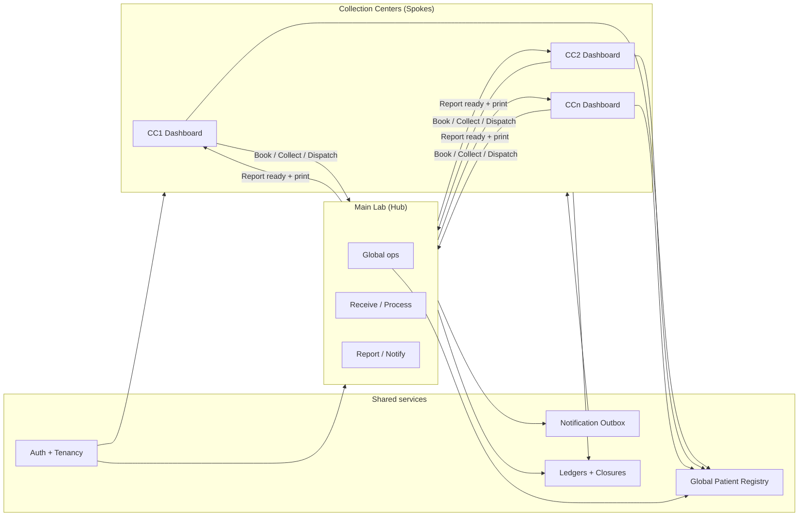
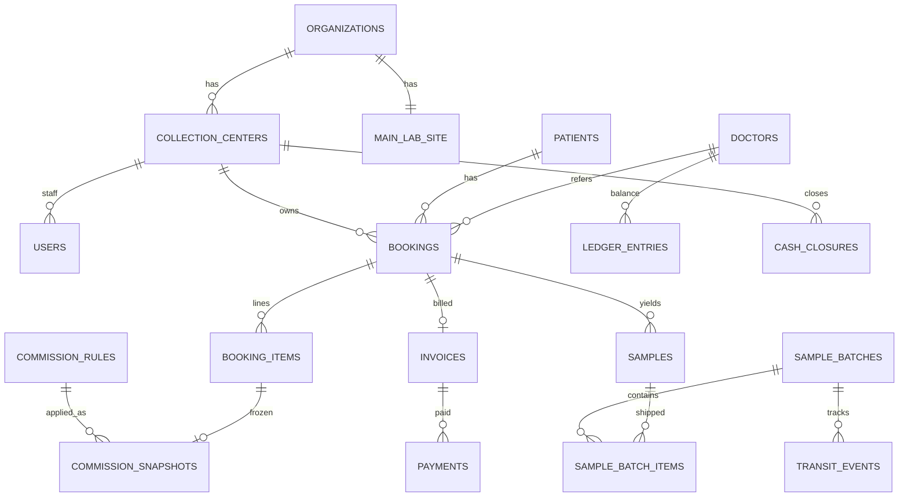
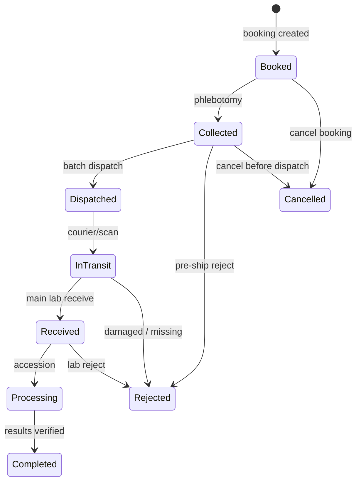
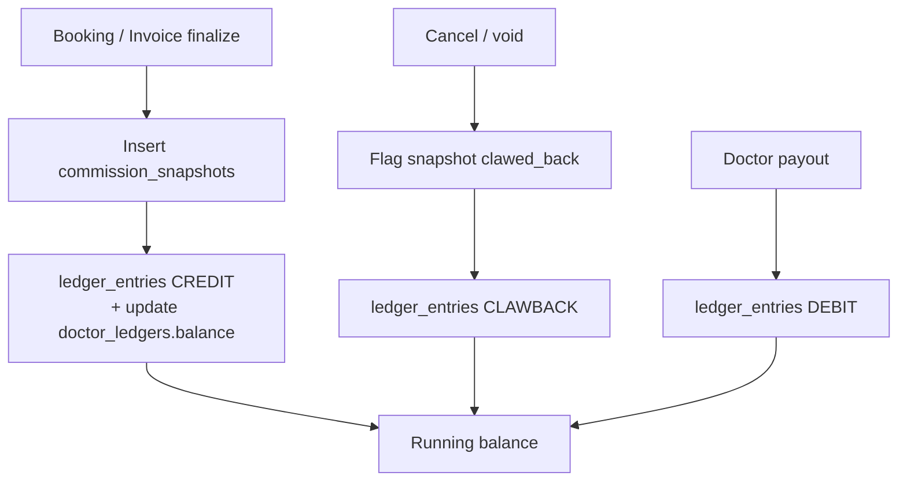

# Hub-and-Spoke LIMS Architecture

**Product:** Madina Medical Complex Hospital Management System  
**Target stack:** Laravel (existing) + PostgreSQL  
**Model:** One **Main Lab (Hub)** ↔ many **Collection Centers (Spokes)**  
**Timezone:** `Asia/Karachi` (aligns with `config/app.php`)

---

## 0. Alignment with existing codebase

Current pathology module is **single-site**:

| Existing | Gap for multi-CC LIMS |
|----------|------------------------|
| `laboratory_patients` = patient + booking + billing + tests JSON | Split into global `patients`, `bookings`, `booking_items`, `invoices` |
| Daily `lab_registration_no` (2-digit) | Replace with CC-prefixed lab numbers `CC1-202607-0001` |
| Vial statuses: collected → in_lab → processing → completed | Add batch transit: booked → dispatched → in_transit → received |
| `refer_by_doctor_name` string; `lab_share` / `hospital_share` unused | Formal `doctors` + commission rules + **immutable snapshots** |
| `users.branch` free text; `LabPermissions` module gates | `collection_center_id` tenancy + role scopes (CC vs Main Lab) |
| Financial summary from booking rows | Per-CC cash closures + Main Lab master reconciliation |
| Desktop SQL Server sync for catalog | Keep catalog sync; bookings become first-class in web DB |

**Migration stance:** Additive greenfield schema under `lims_*` / normalized tables, with a later cutover from `laboratory_patients.selected_tests` JSON. Do not break current Sample Portal / Result Entry until dual-write or backfill is complete.

---

## 1. Architecture overview



**Access rule of thumb**

- **CC user:** `WHERE collection_center_id = auth.cc_id` on bookings, invoices, payments, samples, cash closures, and referral credits *originating* at that CC.
- **Main Lab / Super Admin:** unrestricted (global).
- **Patients:** globally readable for lookup by MR/phone; **create/update** allowed from any CC; mutations audited.

---

## 2. Domain ER overview



---

## 3. Optimized PostgreSQL schema

### 3.1 Enums

```sql
CREATE TYPE org_site_kind AS ENUM ('main_lab', 'collection_center');
CREATE TYPE user_scope AS ENUM ('main_lab', 'collection_center');
CREATE TYPE booking_status AS ENUM (
  'draft', 'booked', 'partially_collected', 'collected',
  'dispatched', 'in_transit', 'received', 'processing',
  'partially_reported', 'reported', 'cancelled'
);
CREATE TYPE sample_status AS ENUM (
  'booked', 'collected', 'dispatched', 'in_transit',
  'received', 'rejected', 'expired', 'processing', 'completed'
);
CREATE TYPE batch_status AS ENUM (
  'open', 'dispatched', 'in_transit', 'received', 'closed', 'cancelled'
);
CREATE TYPE transit_event_type AS ENUM (
  'created', 'dispatched', 'scanned_in_transit',
  'received', 'rejected_item', 'reopened', 'closed'
);
CREATE TYPE invoice_status AS ENUM ('open', 'paid', 'partial', 'void', 'refunded');
CREATE TYPE payment_method AS ENUM ('cash', 'card', 'bank', 'online', 'adjustment');
CREATE TYPE commission_basis AS ENUM ('fixed', 'percent');
CREATE TYPE ledger_entry_type AS ENUM ('credit', 'debit', 'clawback', 'adjustment');
CREATE TYPE ledger_ref_type AS ENUM (
  'booking', 'invoice', 'payout', 'cancellation', 'manual'
);
CREATE TYPE cash_closure_status AS ENUM ('open', 'submitted', 'approved', 'rejected', 'locked');
CREATE TYPE notification_channel AS ENUM ('in_app', 'broadcast', 'whatsapp', 'sms', 'email');
CREATE TYPE outbox_status AS ENUM ('pending', 'processing', 'sent', 'failed', 'dead');
```

### 3.2 Tenancy & org structure

```sql
CREATE TABLE organizations (
  id              BIGSERIAL PRIMARY KEY,
  code            TEXT NOT NULL UNIQUE,          -- e.g. MMC
  name            TEXT NOT NULL,
  timezone        TEXT NOT NULL DEFAULT 'Asia/Karachi',
  created_at      TIMESTAMPTZ NOT NULL DEFAULT now(),
  updated_at      TIMESTAMPTZ NOT NULL DEFAULT now(),
  deleted_at      TIMESTAMPTZ
);

-- Logical sites: exactly one main_lab + N collection centers
CREATE TABLE collection_centers (
  id              BIGSERIAL PRIMARY KEY,
  organization_id BIGINT NOT NULL REFERENCES organizations(id),
  code            TEXT NOT NULL,                 -- e.g. CC1, MAIN
  name            TEXT NOT NULL,
  kind            org_site_kind NOT NULL,
  lab_number_prefix TEXT NOT NULL,              -- e.g. CC1 / MAIN
  address         TEXT,
  phone           TEXT,
  is_active       BOOLEAN NOT NULL DEFAULT true,
  created_at      TIMESTAMPTZ NOT NULL DEFAULT now(),
  updated_at      TIMESTAMPTZ NOT NULL DEFAULT now(),
  deleted_at      TIMESTAMPTZ,
  CONSTRAINT collection_centers_org_code_uq UNIQUE (organization_id, code),
  CONSTRAINT collection_centers_org_prefix_uq UNIQUE (organization_id, lab_number_prefix)
);

-- Enforce at most one main_lab per organization (partial unique)
CREATE UNIQUE INDEX collection_centers_one_main_lab_uq
  ON collection_centers (organization_id)
  WHERE kind = 'main_lab' AND deleted_at IS NULL;
```

### 3.3 Users & roles (extends existing Role/Permission)

```sql
CREATE TABLE lims_roles (
  id              BIGSERIAL PRIMARY KEY,
  name            TEXT NOT NULL UNIQUE,         -- CC Cashier, CC Phlebotomist, Main Lab Tech, ...
  scope           user_scope NOT NULL,
  created_at      TIMESTAMPTZ NOT NULL DEFAULT now(),
  updated_at      TIMESTAMPTZ NOT NULL DEFAULT now()
);

-- Bridge to existing users table; keep LabPermissions module gates
ALTER TABLE users
  ADD COLUMN IF NOT EXISTS organization_id BIGINT REFERENCES organizations(id),
  ADD COLUMN IF NOT EXISTS collection_center_id BIGINT REFERENCES collection_centers(id),
  ADD COLUMN IF NOT EXISTS user_scope user_scope NOT NULL DEFAULT 'collection_center',
  ADD COLUMN IF NOT EXISTS deleted_at TIMESTAMPTZ;

CREATE INDEX users_cc_idx ON users (collection_center_id) WHERE deleted_at IS NULL;

-- Main Lab users: collection_center_id NULL, user_scope = main_lab
-- CC users: collection_center_id NOT NULL, user_scope = collection_center
ALTER TABLE users
  ADD CONSTRAINT users_scope_cc_chk CHECK (
    (user_scope = 'main_lab' AND collection_center_id IS NULL)
    OR (user_scope = 'collection_center' AND collection_center_id IS NOT NULL)
    OR (user_scope = 'collection_center' AND deleted_at IS NOT NULL)
  );
```

Map existing `LabPermissions` to scoped abilities; add:

- `Transit Dispatch`, `Transit Receive`, `Commission Admin`, `Cash Close`, `Cash Approve`, `Doctor Payout`.

### 3.4 Global patients (MR registry)

```sql
CREATE TABLE patients (
  id              BIGSERIAL PRIMARY KEY,
  organization_id BIGINT NOT NULL REFERENCES organizations(id),
  mr_no           TEXT NOT NULL,                -- global within org
  full_name       TEXT NOT NULL,
  gender          TEXT NOT NULL CHECK (gender IN ('Male','Female','Other')),
  date_of_birth   DATE,
  age_years       SMALLINT,                     -- captured-at-visit fallback
  contact_no      TEXT,
  cnic            TEXT,
  address         TEXT,
  created_at_cc_id BIGINT REFERENCES collection_centers(id),
  created_by      BIGINT REFERENCES users(id),
  created_at      TIMESTAMPTZ NOT NULL DEFAULT now(),
  updated_at      TIMESTAMPTZ NOT NULL DEFAULT now(),
  deleted_at      TIMESTAMPTZ,
  CONSTRAINT patients_org_mr_uq UNIQUE (organization_id, mr_no)
);

CREATE INDEX patients_contact_idx ON patients (organization_id, contact_no)
  WHERE contact_no IS NOT NULL AND deleted_at IS NULL;
CREATE INDEX patients_name_trgm_idx ON patients USING gin (full_name gin_trgm_ops);

-- Concurrency-safe MR allocator (replaces SELECT MAX + loop)
CREATE TABLE mr_number_sequences (
  organization_id BIGINT PRIMARY KEY REFERENCES organizations(id),
  next_value      BIGINT NOT NULL DEFAULT 1,
  updated_at      TIMESTAMPTZ NOT NULL DEFAULT now()
);
```

**MR allocation (transactional):**

```sql
UPDATE mr_number_sequences
SET next_value = next_value + 1, updated_at = now()
WHERE organization_id = $1
RETURNING next_value - 1 AS mr_no;
```

### 3.5 Referring doctors & commission rules

```sql
CREATE TABLE doctors (
  id              BIGSERIAL PRIMARY KEY,
  organization_id BIGINT NOT NULL REFERENCES organizations(id),
  code            TEXT,
  name            TEXT NOT NULL,
  phone           TEXT,
  is_active       BOOLEAN NOT NULL DEFAULT true,
  created_at      TIMESTAMPTZ NOT NULL DEFAULT now(),
  updated_at      TIMESTAMPTZ NOT NULL DEFAULT now(),
  deleted_at      TIMESTAMPTZ,
  CONSTRAINT doctors_org_code_uq UNIQUE (organization_id, code)
);

CREATE TABLE test_categories (
  id              BIGSERIAL PRIMARY KEY,
  organization_id BIGINT NOT NULL REFERENCES organizations(id),
  code            TEXT NOT NULL,
  name            TEXT NOT NULL,
  CONSTRAINT test_categories_org_code_uq UNIQUE (organization_id, code)
);

-- Extend existing tests table
ALTER TABLE tests
  ADD COLUMN IF NOT EXISTS test_category_id BIGINT REFERENCES test_categories(id);

CREATE TABLE commission_rules (
  id              BIGSERIAL PRIMARY KEY,
  organization_id BIGINT NOT NULL REFERENCES organizations(id),
  doctor_id       BIGINT REFERENCES doctors(id),          -- NULL = default for all
  test_category_id BIGINT REFERENCES test_categories(id), -- NULL = all categories
  test_id         BIGINT REFERENCES tests(id),            -- NULL = category-level
  collection_center_id BIGINT REFERENCES collection_centers(id), -- NULL = all CCs
  basis           commission_basis NOT NULL,
  amount          NUMERIC(12,2),                          -- when fixed
  percent         NUMERIC(7,4),                           -- when percent (e.g. 10.5000)
  priority        INT NOT NULL DEFAULT 100,               -- lower wins
  effective_from  DATE NOT NULL,
  effective_to    DATE,                                   -- NULL = open-ended
  is_active       BOOLEAN NOT NULL DEFAULT true,
  created_by      BIGINT REFERENCES users(id),
  created_at      TIMESTAMPTZ NOT NULL DEFAULT now(),
  updated_at      TIMESTAMPTZ NOT NULL DEFAULT now(),
  deleted_at      TIMESTAMPTZ,
  CONSTRAINT commission_rules_basis_chk CHECK (
    (basis = 'fixed' AND amount IS NOT NULL AND percent IS NULL)
    OR (basis = 'percent' AND percent IS NOT NULL AND amount IS NULL)
  ),
  CONSTRAINT commission_rules_dates_chk CHECK (
    effective_to IS NULL OR effective_to >= effective_from
  )
);

CREATE INDEX commission_rules_lookup_idx ON commission_rules (
  organization_id, doctor_id, test_category_id, test_id, collection_center_id, priority
) WHERE is_active AND deleted_at IS NULL;
```

**Rule resolution order (most specific wins):**  
`(doctor + test + CC)` → `(doctor + test)` → `(doctor + category + CC)` → `(doctor + category)` → `(doctor)` → org defaults.

### 3.6 Bookings, items, samples

```sql
CREATE TABLE bookings (
  id                  BIGSERIAL PRIMARY KEY,
  organization_id     BIGINT NOT NULL REFERENCES organizations(id),
  collection_center_id BIGINT NOT NULL REFERENCES collection_centers(id),
  patient_id          BIGINT NOT NULL REFERENCES patients(id),
  doctor_id           BIGINT REFERENCES doctors(id),
  self_referred       BOOLEAN NOT NULL DEFAULT false,
  lab_number          TEXT NOT NULL,              -- CC1-202607-0001
  lab_number_year_month CHAR(6) NOT NULL,         -- 202607 (denormalized for seq)
  lab_number_seq      INT NOT NULL,
  priority            TEXT NOT NULL DEFAULT 'Routine'
                        CHECK (priority IN ('Routine','Urgent','STAT')),
  status              booking_status NOT NULL DEFAULT 'booked',
  booked_at           TIMESTAMPTZ NOT NULL DEFAULT now(),
  booked_by           BIGINT REFERENCES users(id),
  cancelled_at        TIMESTAMPTZ,
  cancelled_by        BIGINT REFERENCES users(id),
  cancel_reason       TEXT,
  notes               TEXT,
  sync_id             UUID NOT NULL DEFAULT gen_random_uuid(),
  created_at          TIMESTAMPTZ NOT NULL DEFAULT now(),
  updated_at          TIMESTAMPTZ NOT NULL DEFAULT now(),
  deleted_at          TIMESTAMPTZ,
  CONSTRAINT bookings_lab_number_uq UNIQUE (organization_id, lab_number),
  CONSTRAINT bookings_cc_ym_seq_uq UNIQUE (collection_center_id, lab_number_year_month, lab_number_seq),
  CONSTRAINT bookings_self_ref_chk CHECK (
    (self_referred = true AND doctor_id IS NULL)
    OR (self_referred = false AND doctor_id IS NOT NULL)
  )
);

CREATE INDEX bookings_cc_booked_idx ON bookings (collection_center_id, booked_at DESC)
  WHERE deleted_at IS NULL;
CREATE INDEX bookings_patient_idx ON bookings (patient_id, booked_at DESC)
  WHERE deleted_at IS NULL;
CREATE INDEX bookings_status_idx ON bookings (status) WHERE deleted_at IS NULL;

-- Per-CC monthly sequence (row-lock on allocate)
CREATE TABLE lab_number_sequences (
  collection_center_id BIGINT NOT NULL REFERENCES collection_centers(id),
  year_month           CHAR(6) NOT NULL,          -- YYYYMM Asia/Karachi
  next_seq             INT NOT NULL DEFAULT 1,
  PRIMARY KEY (collection_center_id, year_month)
);

CREATE TABLE booking_items (
  id                  BIGSERIAL PRIMARY KEY,
  booking_id          BIGINT NOT NULL REFERENCES bookings(id),
  collection_center_id BIGINT NOT NULL REFERENCES collection_centers(id), -- denorm for RLS
  test_id             BIGINT NOT NULL REFERENCES tests(id),
  test_category_id    BIGINT REFERENCES test_categories(id),
  test_name_snapshot  TEXT NOT NULL,              -- immutable label
  list_price          NUMERIC(12,2) NOT NULL,
  net_price           NUMERIC(12,2) NOT NULL,     -- after line discount
  discount_amount     NUMERIC(12,2) NOT NULL DEFAULT 0,
  status              TEXT NOT NULL DEFAULT 'pending',
  sample_status       sample_status NOT NULL DEFAULT 'booked',
  created_at          TIMESTAMPTZ NOT NULL DEFAULT now(),
  updated_at          TIMESTAMPTZ NOT NULL DEFAULT now(),
  deleted_at          TIMESTAMPTZ,
  CONSTRAINT booking_items_booking_test_uq UNIQUE (booking_id, test_id)
);

CREATE INDEX booking_items_cc_idx ON booking_items (collection_center_id);

CREATE TABLE samples (
  id                  BIGSERIAL PRIMARY KEY,
  organization_id     BIGINT NOT NULL REFERENCES organizations(id),
  collection_center_id BIGINT NOT NULL REFERENCES collection_centers(id),
  booking_id          BIGINT NOT NULL REFERENCES bookings(id),
  barcode             TEXT NOT NULL,
  vial_type           TEXT,
  vial_number         INT,
  status              sample_status NOT NULL DEFAULT 'booked',
  collected_at        TIMESTAMPTZ,
  collected_by        BIGINT REFERENCES users(id),
  received_at         TIMESTAMPTZ,                -- at main lab
  received_by         BIGINT REFERENCES users(id),
  rejected_at         TIMESTAMPTZ,
  reject_reason       TEXT,
  expires_at          TIMESTAMPTZ,
  created_at          TIMESTAMPTZ NOT NULL DEFAULT now(),
  updated_at          TIMESTAMPTZ NOT NULL DEFAULT now(),
  deleted_at          TIMESTAMPTZ,
  CONSTRAINT samples_org_barcode_uq UNIQUE (organization_id, barcode)
);

CREATE TABLE sample_tests (
  sample_id           BIGINT NOT NULL REFERENCES samples(id) ON DELETE CASCADE,
  booking_item_id     BIGINT NOT NULL REFERENCES booking_items(id),
  PRIMARY KEY (sample_id, booking_item_id)
);
```

### 3.7 Batches, manifests, transit events

```sql
CREATE TABLE sample_batches (
  id                  BIGSERIAL PRIMARY KEY,
  organization_id     BIGINT NOT NULL REFERENCES organizations(id),
  collection_center_id BIGINT NOT NULL REFERENCES collection_centers(id),
  destination_site_id BIGINT NOT NULL REFERENCES collection_centers(id), -- main lab
  manifest_no         TEXT NOT NULL,
  status              batch_status NOT NULL DEFAULT 'open',
  sample_count        INT NOT NULL DEFAULT 0,
  dispatched_at       TIMESTAMPTZ,
  dispatched_by       BIGINT REFERENCES users(id),
  courier_name        TEXT,
  courier_ref         TEXT,
  in_transit_at       TIMESTAMPTZ,
  received_at         TIMESTAMPTZ,
  received_by         BIGINT REFERENCES users(id),
  idempotency_key     TEXT,                       -- client-supplied for dispatch
  notes               TEXT,
  created_at          TIMESTAMPTZ NOT NULL DEFAULT now(),
  updated_at          TIMESTAMPTZ NOT NULL DEFAULT now(),
  deleted_at          TIMESTAMPTZ,
  CONSTRAINT sample_batches_manifest_uq UNIQUE (organization_id, manifest_no),
  CONSTRAINT sample_batches_idem_uq UNIQUE (collection_center_id, idempotency_key)
);

CREATE TABLE sample_batch_items (
  id                  BIGSERIAL PRIMARY KEY,
  batch_id            BIGINT NOT NULL REFERENCES sample_batches(id) ON DELETE CASCADE,
  sample_id           BIGINT NOT NULL REFERENCES samples(id),
  booking_id          BIGINT NOT NULL REFERENCES bookings(id),
  added_at            TIMESTAMPTZ NOT NULL DEFAULT now(),
  receive_status      TEXT NOT NULL DEFAULT 'pending'
                        CHECK (receive_status IN ('pending','received','missing','rejected')),
  receive_note        TEXT,
  CONSTRAINT sample_batch_items_sample_uq UNIQUE (sample_id), -- a sample in at most one active batch
  CONSTRAINT sample_batch_items_batch_sample_uq UNIQUE (batch_id, sample_id)
);

CREATE TABLE transit_events (
  id                  BIGSERIAL PRIMARY KEY,
  batch_id            BIGINT NOT NULL REFERENCES sample_batches(id),
  collection_center_id BIGINT NOT NULL REFERENCES collection_centers(id),
  event_type          transit_event_type NOT NULL,
  occurred_at         TIMESTAMPTZ NOT NULL DEFAULT now(),
  actor_user_id       BIGINT REFERENCES users(id),
  location_label      TEXT,                       -- e.g. "Courier hub", "Main Lab dock"
  payload             JSONB NOT NULL DEFAULT '{}',
  idempotency_key     TEXT,
  created_at          TIMESTAMPTZ NOT NULL DEFAULT now(),
  CONSTRAINT transit_events_idem_uq UNIQUE (batch_id, event_type, idempotency_key)
);

CREATE INDEX transit_events_batch_idx ON transit_events (batch_id, occurred_at);
```

**Transit state machine**



Allowed transitions enforced in application + optional DB trigger / CHECK via status history table.

### 3.8 Invoices, payments, commission snapshots

```sql
CREATE TABLE invoices (
  id                  BIGSERIAL PRIMARY KEY,
  organization_id     BIGINT NOT NULL REFERENCES organizations(id),
  collection_center_id BIGINT NOT NULL REFERENCES collection_centers(id),
  booking_id          BIGINT NOT NULL REFERENCES bookings(id),
  invoice_no          TEXT NOT NULL,
  status              invoice_status NOT NULL DEFAULT 'open',
  sub_total           NUMERIC(12,2) NOT NULL,
  discount_total      NUMERIC(12,2) NOT NULL DEFAULT 0,
  grand_total         NUMERIC(12,2) NOT NULL,
  paid_total          NUMERIC(12,2) NOT NULL DEFAULT 0,
  due_total           NUMERIC(12,2) NOT NULL,
  invoiced_at         TIMESTAMPTZ NOT NULL DEFAULT now(),
  voided_at           TIMESTAMPTZ,
  created_by          BIGINT REFERENCES users(id),
  created_at          TIMESTAMPTZ NOT NULL DEFAULT now(),
  updated_at          TIMESTAMPTZ NOT NULL DEFAULT now(),
  deleted_at          TIMESTAMPTZ,
  CONSTRAINT invoices_org_no_uq UNIQUE (organization_id, invoice_no),
  CONSTRAINT invoices_booking_uq UNIQUE (booking_id)  -- 1:1 for v1; revise if multi-invoice
);

CREATE TABLE payments (
  id                  BIGSERIAL PRIMARY KEY,
  organization_id     BIGINT NOT NULL REFERENCES organizations(id),
  collection_center_id BIGINT NOT NULL REFERENCES collection_centers(id),
  invoice_id          BIGINT NOT NULL REFERENCES invoices(id),
  method              payment_method NOT NULL,
  amount              NUMERIC(12,2) NOT NULL CHECK (amount > 0),
  paid_at             TIMESTAMPTZ NOT NULL DEFAULT now(),
  received_by         BIGINT REFERENCES users(id),
  cash_closure_id     BIGINT,                     -- FK added after cash_closures
  idempotency_key     TEXT,
  notes               TEXT,
  created_at          TIMESTAMPTZ NOT NULL DEFAULT now(),
  deleted_at          TIMESTAMPTZ,
  CONSTRAINT payments_cc_idem_uq UNIQUE (collection_center_id, idempotency_key)
);

CREATE INDEX payments_cc_paid_idx ON payments (collection_center_id, paid_at)
  WHERE deleted_at IS NULL;

-- CRITICAL: immutable financial facts — never UPDATE amount fields after insert
CREATE TABLE commission_snapshots (
  id                  BIGSERIAL PRIMARY KEY,
  organization_id     BIGINT NOT NULL REFERENCES organizations(id),
  collection_center_id BIGINT NOT NULL REFERENCES collection_centers(id),
  booking_id          BIGINT NOT NULL REFERENCES bookings(id),
  booking_item_id     BIGINT NOT NULL REFERENCES booking_items(id),
  invoice_id          BIGINT REFERENCES invoices(id),
  doctor_id           BIGINT NOT NULL REFERENCES doctors(id),
  commission_rule_id  BIGINT REFERENCES commission_rules(id), -- null if manual override
  rule_basis          commission_basis NOT NULL,
  rule_amount         NUMERIC(12,2),
  rule_percent        NUMERIC(7,4),
  base_amount         NUMERIC(12,2) NOT NULL,     -- net_price used at snapshot time
  commission_amount   NUMERIC(12,2) NOT NULL,     -- frozen currency amount
  currency            CHAR(3) NOT NULL DEFAULT 'PKR',
  snapshotted_at      TIMESTAMPTZ NOT NULL DEFAULT now(),
  snapshotted_by      BIGINT REFERENCES users(id),
  is_clawed_back      BOOLEAN NOT NULL DEFAULT false,
  clawed_back_at      TIMESTAMPTZ,
  -- Soft immutability: no updated_at for money fields; only clawback flags
  CONSTRAINT commission_snapshots_item_uq UNIQUE (booking_item_id)
);

CREATE INDEX commission_snapshots_doctor_idx
  ON commission_snapshots (doctor_id, snapshotted_at);
CREATE INDEX commission_snapshots_cc_idx
  ON commission_snapshots (collection_center_id, snapshotted_at);
```

**Application rule:** `UPDATE commission_snapshots` allowed only for `is_clawed_back` / `clawed_back_at`. Prefer revoke via ledger clawback + flag, never recalculate `commission_amount`.

### 3.9 Doctor ledgers

```sql
CREATE TABLE doctor_ledgers (
  doctor_id           BIGINT PRIMARY KEY REFERENCES doctors(id),
  organization_id     BIGINT NOT NULL REFERENCES organizations(id),
  balance             NUMERIC(14,2) NOT NULL DEFAULT 0,
  updated_at          TIMESTAMPTZ NOT NULL DEFAULT now()
);

CREATE TABLE ledger_entries (
  id                  BIGSERIAL PRIMARY KEY,
  organization_id     BIGINT NOT NULL REFERENCES organizations(id),
  doctor_id           BIGINT NOT NULL REFERENCES doctors(id),
  collection_center_id BIGINT REFERENCES collection_centers(id), -- originating CC
  entry_type          ledger_entry_type NOT NULL,
  amount              NUMERIC(12,2) NOT NULL CHECK (amount > 0), -- always positive; type signs it
  balance_after       NUMERIC(14,2) NOT NULL,
  ref_type            ledger_ref_type NOT NULL,
  ref_id              BIGINT,
  commission_snapshot_id BIGINT REFERENCES commission_snapshots(id),
  payout_id           BIGINT,                     -- FK after payouts
  narration           TEXT,
  occurred_at         TIMESTAMPTZ NOT NULL DEFAULT now(),
  created_by          BIGINT REFERENCES users(id),
  idempotency_key     TEXT NOT NULL,
  created_at          TIMESTAMPTZ NOT NULL DEFAULT now(),
  CONSTRAINT ledger_entries_idem_uq UNIQUE (doctor_id, idempotency_key)
);

CREATE INDEX ledger_entries_doctor_idx ON ledger_entries (doctor_id, occurred_at DESC);
CREATE INDEX ledger_entries_cc_idx ON ledger_entries (collection_center_id, occurred_at DESC);

CREATE TABLE doctor_payouts (
  id                  BIGSERIAL PRIMARY KEY,
  organization_id     BIGINT NOT NULL REFERENCES organizations(id),
  doctor_id           BIGINT NOT NULL REFERENCES doctors(id),
  amount              NUMERIC(12,2) NOT NULL CHECK (amount > 0),
  paid_at             TIMESTAMPTZ NOT NULL DEFAULT now(),
  paid_by             BIGINT REFERENCES users(id),
  method              payment_method NOT NULL DEFAULT 'cash',
  notes               TEXT,
  idempotency_key     TEXT NOT NULL,
  created_at          TIMESTAMPTZ NOT NULL DEFAULT now(),
  CONSTRAINT doctor_payouts_idem_uq UNIQUE (organization_id, idempotency_key)
);

ALTER TABLE ledger_entries
  ADD CONSTRAINT ledger_entries_payout_fk
  FOREIGN KEY (payout_id) REFERENCES doctor_payouts(id);
```



### 3.10 Cash closures

```sql
CREATE TABLE cash_closures (
  id                  BIGSERIAL PRIMARY KEY,
  organization_id     BIGINT NOT NULL REFERENCES organizations(id),
  collection_center_id BIGINT NOT NULL REFERENCES collection_centers(id),
  business_date       DATE NOT NULL,              -- Asia/Karachi calendar date
  shift_label         TEXT NOT NULL DEFAULT 'day',
  status              cash_closure_status NOT NULL DEFAULT 'open',
  opening_float       NUMERIC(12,2) NOT NULL DEFAULT 0,
  system_cash_total   NUMERIC(12,2) NOT NULL DEFAULT 0,
  system_card_total   NUMERIC(12,2) NOT NULL DEFAULT 0,
  system_other_total  NUMERIC(12,2) NOT NULL DEFAULT 0,
  counted_cash_total  NUMERIC(12,2),
  variance_cash       NUMERIC(12,2),
  booking_count       INT NOT NULL DEFAULT 0,
  payment_count       INT NOT NULL DEFAULT 0,
  summary_json        JSONB NOT NULL DEFAULT '{}', -- category breakdown for UI
  submitted_at        TIMESTAMPTZ,
  submitted_by        BIGINT REFERENCES users(id),
  approved_at         TIMESTAMPTZ,
  approved_by         BIGINT REFERENCES users(id),
  rejection_reason    TEXT,
  idempotency_key     TEXT,
  created_at          TIMESTAMPTZ NOT NULL DEFAULT now(),
  updated_at          TIMESTAMPTZ NOT NULL DEFAULT now(),
  CONSTRAINT cash_closures_cc_date_shift_uq UNIQUE (collection_center_id, business_date, shift_label),
  CONSTRAINT cash_closures_idem_uq UNIQUE (collection_center_id, idempotency_key)
);

ALTER TABLE payments
  ADD CONSTRAINT payments_cash_closure_fk
  FOREIGN KEY (cash_closure_id) REFERENCES cash_closures(id);

-- One open closure per CC+date+shift
CREATE UNIQUE INDEX cash_closures_one_open_uq
  ON cash_closures (collection_center_id, business_date, shift_label)
  WHERE status = 'open';
```

### 3.11 Notifications / outbox

```sql
CREATE TABLE notification_outbox (
  id                  BIGSERIAL PRIMARY KEY,
  organization_id     BIGINT NOT NULL REFERENCES organizations(id),
  collection_center_id BIGINT REFERENCES collection_centers(id), -- target CC
  channel             notification_channel NOT NULL DEFAULT 'in_app',
  event_name          TEXT NOT NULL,              -- e.g. report.ready
  aggregate_type      TEXT NOT NULL,              -- booking / sample / batch
  aggregate_id        BIGINT NOT NULL,
  payload             JSONB NOT NULL,
  status              outbox_status NOT NULL DEFAULT 'pending',
  attempts            INT NOT NULL DEFAULT 0,
  available_at        TIMESTAMPTZ NOT NULL DEFAULT now(),
  processed_at        TIMESTAMPTZ,
  last_error          TEXT,
  idempotency_key     TEXT NOT NULL,
  created_at          TIMESTAMPTZ NOT NULL DEFAULT now(),
  CONSTRAINT notification_outbox_idem_uq UNIQUE (organization_id, idempotency_key)
);

CREATE INDEX notification_outbox_poll_idx
  ON notification_outbox (status, available_at)
  WHERE status IN ('pending', 'failed');

CREATE TABLE in_app_notifications (
  id                  BIGSERIAL PRIMARY KEY,
  organization_id     BIGINT NOT NULL REFERENCES organizations(id),
  collection_center_id BIGINT NOT NULL REFERENCES collection_centers(id),
  user_id             BIGINT REFERENCES users(id), -- null = all users at CC
  title               TEXT NOT NULL,
  body                TEXT NOT NULL,
  link_url            TEXT,
  read_at             TIMESTAMPTZ,
  created_at          TIMESTAMPTZ NOT NULL DEFAULT now()
);

CREATE INDEX in_app_notifications_cc_idx
  ON in_app_notifications (collection_center_id, created_at DESC);
```

### 3.12 Report-ready link (extends existing results)

```sql
CREATE TABLE report_releases (
  id                  BIGSERIAL PRIMARY KEY,
  booking_id          BIGINT NOT NULL REFERENCES bookings(id),
  booking_item_id     BIGINT NOT NULL REFERENCES booking_items(id),
  collection_center_id BIGINT NOT NULL REFERENCES collection_centers(id),
  released_at         TIMESTAMPTZ NOT NULL DEFAULT now(),
  released_by         BIGINT REFERENCES users(id),
  notify_outbox_id    BIGINT REFERENCES notification_outbox(id),
  CONSTRAINT report_releases_item_uq UNIQUE (booking_item_id)
);
```

---

## 4. Core API endpoints

Base: `/api/v1` · Auth: Sanctum / session · Headers: `Idempotency-Key` on mutating POSTs · Tenancy from JWT/session claims.

### 4.1 Sample transit workflow

| Method | Path | Actor | Purpose |
|--------|------|-------|---------|
| `POST` | `/sample-batches` | CC | Create open batch/manifest |
| `POST` | `/sample-batches/{id}/items` | CC | Add collected samples (barcode scan) |
| `DELETE` | `/sample-batches/{id}/items/{sampleId}` | CC | Remove before dispatch |
| `POST` | `/sample-batches/{id}/dispatch` | CC | **Booked/Collected → Dispatched**; seal manifest |
| `POST` | `/sample-batches/{id}/in-transit` | CC/Courier/Main | Scan → **In Transit** |
| `POST` | `/sample-batches/{id}/receive` | Main Lab | **Received**; per-item receive/missing/reject |
| `GET` | `/sample-batches/{id}` | CC or Main | Manifest + events |
| `GET` | `/sample-batches` | scoped | List by status / CC / date |
| `GET` | `/sample-batches/{id}/events` | scoped | Transit event audit |
| `POST` | `/bookings/{id}/items/{itemId}/report-ready` | Main Lab | Mark reportable; enqueue notify |
| `POST` | `/report-releases` | Main Lab | Bulk release + notify originating CCs |
| `GET` | `/notifications` | CC | In-app feed (print/handover) |
| `POST` | `/notifications/{id}/read` | CC | Mark read |

#### Dispatch body (example)

```json
{
  "courier_name": "City Runner",
  "courier_ref": "CR-9921",
  "sample_barcodes": ["CC1-202607-0001-V1", "CC1-202607-0002-V1"],
  "idempotency_key": "cc1-dispatch-2026-07-20-a1"
}
```

#### Receive body (example)

```json
{
  "received_at": "2026-07-20T14:05:00+05:00",
  "items": [
    { "sample_id": 101, "receive_status": "received" },
    { "sample_id": 102, "receive_status": "missing", "receive_note": "Not in box" },
    { "sample_id": 103, "receive_status": "rejected", "receive_note": "Hemolyzed" }
  ],
  "idempotency_key": "main-recv-batch-55"
}
```

**Side effects on dispatch**

1. Lock batch row (`FOR UPDATE`).
2. Validate all items `sample_status = collected`.
3. Set batch `dispatched`, samples `dispatched`, bookings advance if all samples shipped.
4. Append `transit_events(dispatched)`.
5. Idempotent no-op if same `idempotency_key`.

**Side effects on report-ready**

1. Insert `report_releases`.
2. Insert `notification_outbox` with `event_name=report.ready`, `collection_center_id=booking.collection_center_id`.
3. Broadcast (Laravel Echo / Reverb) to CC private channel `cc.{id}`.

### 4.2 Doctor commission snapshotting

| Method | Path | Actor | Purpose |
|--------|------|-------|---------|
| `GET` | `/commission-rules` | Main Lab | List / filter rules |
| `POST` | `/commission-rules` | Commission Admin | Create rule |
| `PUT` | `/commission-rules/{id}` | Commission Admin | Update **future** applicability only |
| `POST` | `/commission-rules/{id}/deactivate` | Commission Admin | Soft-end rule (`effective_to=today`) |
| `POST` | `/bookings` | CC | Create booking; **snapshot commissions in same TX** |
| `POST` | `/bookings/{id}/finalize-invoice` | CC | Invoice + ensure snapshots exist |
| `GET` | `/commission-snapshots` | scoped | Audit frozen amounts |
| `POST` | `/bookings/{id}/cancel` | CC/Main | Cancel + clawback ledger |
| `GET` | `/doctors/{id}/ledger` | Main / scoped | Entries + balance |
| `POST` | `/doctors/{id}/payouts` | Main Lab | Debit ledger |
| `GET` | `/doctors/{id}/payouts` | Main Lab | Payout history |

#### Snapshot algorithm (same DB transaction as booking/invoice)

```
for each booking_item:
  if self_referred: skip
  rule = resolve_commission_rule(doctor, test, category, CC, booked_at::date)
  if no rule: commission_amount = 0 (optional policy: block booking)
  amount = rule.fixed OR round(net_price * percent/100, 2)
  INSERT commission_snapshots (... immutable fields ...)
  INSERT ledger_entries CREDIT with idempotency_key = "credit:snapshot:{booking_item_id}"
  UPDATE doctor_ledgers SET balance = balance + amount
```

#### Clawback on cancel

```
for each snapshot where booking_id=X AND NOT is_clawed_back:
  flag is_clawed_back
  INSERT ledger_entries CLAWBACK amount=snapshot.commission_amount
    idempotency_key = "clawback:snapshot:{id}"
  UPDATE doctor_ledgers SET balance = balance - amount
```

Never re-resolve rules on cancel/payout/report.

---

## 5. Edge cases (Main Lab ↔ CC)

1. **Partial batch receive** — some vials missing/rejected; booking stays `partially_*`; only received items proceed; CC notified of exceptions.
2. **Split shipments** — same booking’s vials in multiple batches (allow by removing unique-on-sample only for *active* batches via partial unique: one non-terminal batch per sample).
3. **Patient registered at CC-A, books at CC-B** — global MR; booking/invoice/sample tagged CC-B; CC-A cannot see CC-B financials.
4. **Report ready while CC cash drawer closed** — notification still delivered; print/handover is operational, not cash-tied.
5. **Cancel after dispatch** — financial clawback yes; physically recall sample; Main Lab must ack reject/return event before booking `cancelled` if already `received`.
6. **Cancel after payout** — clawback can drive doctor balance **negative**; payout UI warns; require adjustment payment or hold future credits.
7. **Commission rule edited mid-day** — old bookings untouched; new bookings use new rule by `effective_from` + `booked_at`.
8. **Double-submit dispatch/receive** — idempotency keys + unique constraints; return original resource.
9. **Lab number race** — allocate via `lab_number_sequences` `UPDATE … RETURNING` inside booking TX; never `MAX(seq)+1` without lock.
10. **Clock skew across sites** — store TIMESTAMPTZ; business_date from `Asia/Karachi`; courier scans use server time.
11. **Offline CC** — local queue with idempotency keys; sync push similar to existing `CloudSyncController`; reject conflicting lab numbers from sequence authority on hub.
12. **STAT priority** — separate courier batch or flag on manifest; Main Lab worklist sorted STAT first.
13. **Sample barcode collision** — unique per organization; barcode = `{lab_number}-V{n}` recommended.
14. **Discount after snapshot** — **forbidden** without void+rebook; or explicit “adjustment booking” that creates new snapshots (never mutate).
15. **Multi-doctor / panel packages** — snapshot per `booking_item`; package expansion at book time into items.
16. **CC user queries Main Lab endpoints** — 403 via policy; never rely on UI hiding alone.
17. **Cash closure with unsettled due** — allow close with `due_total` listed in summary; Main Lab sees receivables aging by CC.
18. **WhatsApp report to patient vs CC print notify** — two outbox events (`report.ready.cc`, `report.ready.patient`); failures isolated.
19. **Desktop SQL Server dual-run** — during migration, map `Leb_reg_test_info` into `bookings` with `collection_center_id=MAIN` default.
20. **Soft-deleted CC** — block new bookings; historical ledgers remain queryable by Main Lab.

---

## 6. Business logic notes

### 6.1 Lab numbering

Format: `{prefix}-{YYYYMM}-{seq:04d}` e.g. `CC1-202607-0001`.

- `YYYYMM` from `Asia/Karachi` at booking time.
- Sequence per `(collection_center_id, year_month)` via `lab_number_sequences`.
- Unique: `(organization_id, lab_number)` and `(collection_center_id, year_month, seq)`.
- Barcodes derive from lab number + vial index.
- Replaces current daily 2-digit `LaboratoryPatient::generateLabRegistrationNo()`.

### 6.2 Tenancy / RLS strategy

**Layered enforcement (recommended for Laravel):**

1. **Claims:** session stores `user_scope`, `collection_center_id`, `organization_id`.
2. **Global scopes / Policies:** `BelongsToCollectionCenter` scope applied to Booking, Invoice, Payment, Sample, CashClosure, Batch (for CC users).
3. **Query filters in API resources** — never accept client-supplied `collection_center_id` for CC users (force from auth).
4. **Optional Postgres RLS** for defense-in-depth on reporting replicas:

```sql
ALTER TABLE bookings ENABLE ROW LEVEL SECURITY;
CREATE POLICY bookings_cc_isolation ON bookings
  USING (
    current_setting('app.is_main_lab', true) = 'true'
    OR collection_center_id = NULLIF(current_setting('app.collection_center_id', true), '')::bigint
  );
```

Set `app.collection_center_id` / `app.is_main_lab` per request in a middleware DB `SET LOCAL`.

5. **Patients** — SELECT allowed org-wide; INSERT stamps `created_at_cc_id`; no financial bleed.

### 6.3 When to snapshot commissions

| Moment | Action |
|--------|--------|
| **Booking confirmed** (status→`booked`) | Primary snapshot + ledger CREDIT (preferred) |
| Invoice finalize (if book is draft) | Snapshot if missing (safety net) |
| Rule CRUD | Never touches past snapshots |
| Result entry / report ready | **No** commission changes |
| Cancel / void | Clawback only using snapshot amounts |
| Payout | DEBIT only; no recompute |

**Invariant:** `commission_snapshots.commission_amount` is write-once. Ledgers are the only mutable financial projection (`doctor_ledgers.balance`), rebuilt/verified from `ledger_entries` if needed.

### 6.4 Cash closure reconciliation

1. CC opens shift → `cash_closures` row `open`.
2. Payments optionally stamp `cash_closure_id` for current open shift.
3. Pre-close summary: system totals by method, booking counts, dues, commission credits generated today (informational).
4. Submit with counted cash → `submitted`; variance computed.
5. Main Lab master view: all CC closures for `business_date`, variances, unapproved list.
6. Approve → `locked`; further payments that day start next shift or next business day per policy.

---

## 7. Implementation phasing (suggested)

| Phase | Scope |
|-------|-------|
| **P0** ✅ | `organizations`, `collection_centers`, user scope, global patients + MR sequence — **implemented** (`docs/lims-phase-0.md`; table `lims_patients`) |
| **P1** ✅ | Normalized `lims_bookings` / `lims_booking_items` / `lims_invoices` / `lims_payments`; dual-write from booking UI — **implemented** (`docs/lims-phase-1.md`) |
| **P2** ✅ | `lims_samples` / `lims_sample_batches` + transit APIs; vial dual-write Collected → Dispatch → Receive — **implemented** (`docs/lims-phase-2.md`) |
| **P3** | Commission rules + snapshots + doctor ledger + payouts |
| **P4** | Cash closures + Main Lab reconciliation dashboard |
| **P5** | Outbox + realtime CC notifications on report ready; deprecate JSON `selected_tests` |

---

## 8. Mapping from current tables

| Current | Target |
|---------|--------|
| `laboratory_patients.mr_no` | `patients.mr_no` |
| `laboratory_patients` row | `bookings` + `invoices` + payments |
| `selected_tests[]` | `booking_items` + `samples` / `sample_tests` |
| `lab_registration_no` | `bookings.lab_number` |
| `lab_sample_vials` | `samples` (+ batch membership) |
| `refer_by_doctor_name` | `doctors` + `bookings.doctor_id` |
| `lab_share_total` / `hospital_share_total` | replaced by commission snapshots + org P&L views |
| `users.branch` | `users.collection_center_id` |
| `LabPermissions` | keep + add transit/commission/cash permissions |

---

*Document version: 1.0 · Hub-and-Spoke LIMS for Hospital-Management-System*
